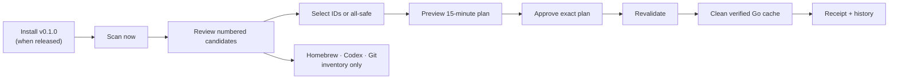

<p align="center">
  
</p>

# StillMac

StillMac is a local macOS diagnostic and developer-cache cleanup CLI. The cleanup slice is deliberately narrow: it can reclaim measured bytes only from the exact Go build cache by invoking the verified owner-native Go action `go clean -cache`. Homebrew, Codex runtimes, and Git worktrees are inventory only.

This repository is an unpublished beta candidate. The Go binary has no network client, telemetry, scheduler, LLM dependency, process-control capability, arbitrary deletion, or privilege escalation.

## Installation routes

All three routes are **INACTIVE**. No GitHub Release, activated installer, Homebrew tap formula, or published Agent Skill currently exists. These commands document the intended routes, not working installation claims.

Direct installer, **INACTIVE until the `v0.1.0` release asset exists**. The concise intended command is:

```bash
curl -fsSL https://github.com/HYPHNLabs/StillMac/releases/download/v0.1.0/stillmac-install-v0.1.0.sh | sh
```

For the safer inspect-first route, download that same pinned release asset, inspect the downloaded script, then run it:

```bash
curl -fsSL -o stillmac-install-v0.1.0.sh https://github.com/HYPHNLabs/StillMac/releases/download/v0.1.0/stillmac-install-v0.1.0.sh
less stillmac-install-v0.1.0.sh
sh stillmac-install-v0.1.0.sh
```

Homebrew, **INACTIVE**:

```bash
brew install HYPHNLabs/tap/stillmac
```

Agent Skill, **INACTIVE**:

```bash
npx skills add HYPHNLabs/StillMac -g
```

The checked-in `scripts/install.sh` fails closed. See [INSTALL.md](INSTALL.md) and [docs/DISTRIBUTION-CONTRACT.md](docs/DISTRIBUTION-CONTRACT.md).

## How it works



StillMac never jumps from scan to cleanup. Only a verified Go build-cache candidate can enter the approval path; every other current family remains visible but non-executable.

## Working commands

Build the current source candidate:

```bash
mkdir -p ./bin
go build -trimpath -o ./bin/stillmac ./cmd/stillmac
```

Read-only baseline commands remain available:

```bash
stillmac doctor
stillmac sample
stillmac status
stillmac report --format markdown
stillmac report --format json
```

`sample` is always explicit. There is no `stillmac learn` command and no scheduler.

The developer cleanup flow is scan, inspect, plan, approve, then apply:

```bash
stillmac scan --format text
stillmac scan --scope /path/to/project --format json
stillmac explain sm-0123456789abcdef --format text
stillmac plan all-safe --format text
stillmac plan sm-0123456789abcdef sm-fedcba9876543210 --format json
stillmac apply plan-0123456789abcdef --format json
stillmac protect sm-0123456789abcdef
stillmac history --format text
stillmac clean all
stillmac clean 1 3
stillmac help
```

The IDs above are shape examples only. Text scans number the current rows while also showing stable IDs. A human may use fresh row numbers with interactive `clean` (for example `clean 1 3`); `plan` and agent workflows use stable IDs. Numbers are never persisted. Never invent IDs, and never mix `all` with explicit selections.

`scan`, `explain`, `plan`, `protect`, and `clean` accept `--scope PATH` where documented. Scope adds Git worktree inventory. It does not create a project cache convention and is not derived from `--data-dir`. `plan`, `apply`, `protect`, `history`, and `clean` accept `--data-dir PATH`. Text and JSON are available where shown by `help` and the cleanup contract.

`clean` is only a convenience wrapper for an interactive terminal. It prints every candidate, prints exclusions, creates the exact plan, and accepts only `apply PLAN_ID`. Non-TTY callers must use `plan` and `apply`.

## Decisions

- `SAFE`: under ordinary operation, the exact Go build cache and owner-native Go tool satisfy the bounded executable rule; this is not immunity to equivalent-user malware.
- `REVIEW`: inventory worth human review, with no executable action.
- `PROTECTED`: explicitly protected in private StillMac state.
- `BLOCKED_ACTIVE`: current, main, locked, or activity not safely disproved.
- `BLOCKED_DIRTY`: a Git worktree has local changes.
- `BLOCKED_UNMERGED`: Git cannot prove HEAD is merged into `main`.
- `BLOCKED_UNKNOWN`: identity or safety cannot be established.
- `BLOCKED_CHANGED`: apply-time state differs from the plan.

There is no generic `BLOCKED` decision.

## Cleanup boundaries

Default scan roots are exactly:

- `$HOME/Library/Caches/Homebrew`
- `$HOME/Library/Caches/go-build`
- `$HOME/.cache/codex-runtimes`

Codex runtime data is never executable in this release. Without injected inactivity proof it is `BLOCKED_ACTIVE`; even with proof it is `REVIEW`. StillMac never scans the whole `.codex`, `.claude`, or `.hermes` trees, Application Support conversations, credentials, memories, skills, config, or cache contents.

Git worktrees are inventory-only. StillMac uses `git worktree list --porcelain` and per-worktree status and merge checks, emits one path-free candidate per linked worktree, and never executes a Git cleanup action or uses force.

Homebrew is always `REVIEW` with action `none` until a narrowly bounded owner-native operation is designed. Go is `SAFE` only when StillMac resolves an absolute Go executable, follows it to a regular executable with acceptable ownership and permissions, binds its device, inode, fingerprint and version, and verifies under a minimal fixed environment that `go env GOCACHE` equals the exact allowlisted `$HOME/Library/Caches/go-build`. Failure to establish any part is `BLOCKED_UNKNOWN`.

Apply revalidates the plan, host, protection, rule, cache identity and fingerprint, and private executable binding immediately before invoking only `<verified-absolute-go> clean -cache` without a shell. These checks reduce accidental or stale changes but are not atomic with `execve` or Go pathname resolution. Approval authorizes `go clean -cache` against the logical exact GOCACHE pathname; malicious concurrent same-UID replacement is explicitly out of scope. It then measures the exact cache again. A successful receipt uses method `owner-native-go-clean-cache`, result `cleaned`, `moved_bytes=0`, and `removed_bytes` and `reclaimed_bytes` equal to `max(before_bytes-after_bytes, 0)`. This action actually frees measured cache bytes, and later Go builds may spend time rebuilding them. A failed owner action reports `owner_action_failed` with no claimed removed or reclaimed bytes.

Plans expire after 15 minutes. They are schema-versioned, hash-addressed, bound to an opaque host binding and a private target registry, and revalidated immediately before action. Protection, root replacement, fingerprint change, decision change, rule change, unsafe paths, or state corruption fails closed.

## Data and privacy

The default data directory is:

```text
$HOME/Library/Application Support/StillMac
```

Baseline history, cleanup plans, private target registries, protection records, and receipts are local. Private directories use `0700` and regular state files use `0600`. Public JSON excludes absolute HOME and project paths, executable paths, usernames, command arguments, and unrelated filenames.

The uninstaller removes only the regular installed binary and keeps baseline and cleanup state. See [UNINSTALL.md](UNINSTALL.md), [PRIVACY.md](PRIVACY.md), and [docs/DATA-LOCATIONS.md](docs/DATA-LOCATIONS.md).

## Compatibility and verification

- Executed locally: Apple Silicon, macOS 26.5.
- Target: macOS 14 or later.
- Cross-build targets: Darwin arm64 and amd64.
- Not claimed: Intel runtime compatibility or macOS 14 runtime verification.

```bash
gofmt -w .
go test -count=1 -race ./...
go vet ./...
go build -trimpath -o ./bin/stillmac ./cmd/stillmac
python3 -m unittest discover -s tests -v
sh -n scripts/*.sh scripts/install.sh.tmpl
git diff --check
```

Normative behaviour is in [docs/V0.1-TRACER-CONTRACT.md](docs/V0.1-TRACER-CONTRACT.md) and [docs/DEVELOPER-CLEANUP-CONTRACT.md](docs/DEVELOPER-CLEANUP-CONTRACT.md).
