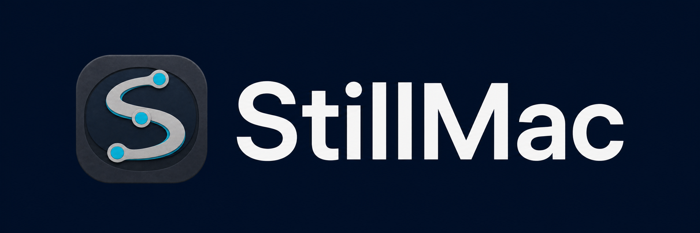

<p align="center">
  
</p>

# StillMac

StillMac is a local macOS CLI for inspecting process and memory snapshots and reviewing developer caches that may be using disk space.

It is deliberately conservative. StillMac can clean only the exact Go build cache, and only after you review and approve a short-lived plan. Homebrew caches, Codex runtimes, and Git worktrees are reported for review but remain inventory-only.

## What StillMac does

- Captures explicit, local process and memory snapshots for baseline reports.
- Scans a fixed set of developer-cache roots and reports measured size and safety decisions.
- Adds path-minimised Git worktree inventory when you provide a project scope.
- Creates a 15-minute cleanup plan for eligible items.
- Uses the verified owner-native action `go clean -cache` for the exact Go build cache after explicit approval and revalidation.
- Writes a receipt showing measured bytes before and after the action.

StillMac does **not** delete Homebrew caches, Codex runtimes, or Git worktrees. It does not scan arbitrary locations, terminate processes, elevate privileges, run in the background, or perform mystery deletion.

## Current status

StillMac `v0.1.1` is the first public beta. It supports **Apple Silicon Macs only** and has been executed on macOS 26.5. Other macOS versions are not yet verified runtime claims.

Homebrew and Agent Skill distribution remain inactive. See [INSTALL.md](INSTALL.md) for the exact lifecycle and inspect-first route.

## Install

```bash
curl -fsSL https://github.com/HYPHNLabs/StillMac/releases/download/v0.1.1/stillmac-install-v0.1.1.sh | sh
```

The installer is pinned to the `v0.1.1` manifest, verifies the archive checksum, installs per-user without `sudo`, and runs `doctor` before replacing an existing binary.

Inspect first:

```bash
curl -fsSLo /tmp/stillmac-install-v0.1.1.sh \
  https://github.com/HYPHNLabs/StillMac/releases/download/v0.1.1/stillmac-install-v0.1.1.sh
less /tmp/stillmac-install-v0.1.1.sh
sh /tmp/stillmac-install-v0.1.1.sh
```

## Build from source

Requirements:

- macOS
- Go 1.23 or later

```bash
git clone https://github.com/HYPHNLabs/StillMac.git
cd StillMac
mkdir -p ./bin
go build -buildvcs=false -trimpath -o ./bin/stillmac ./cmd/stillmac
./bin/stillmac help
```

The public beta is Apple Silicon only. It has been executed locally on macOS 26.5.

## Start with a read-only scan

Check the local setup, then scan the default developer-cache roots:

```bash
./bin/stillmac doctor
./bin/stillmac scan --format text
```

To include path-free Git worktree inventory for one project:

```bash
./bin/stillmac scan --scope /path/to/project --format text
```

A scan measures and classifies. It does not clean anything.

Process and memory sampling is separate and always explicit:

```bash
./bin/stillmac sample
./bin/stillmac status
./bin/stillmac report --format markdown
```

There is no scheduler and no `stillmac learn` command.

## Review, plan, approve, apply

Use the stable candidate ID printed by the scan. The IDs below are examples only. Never invent or reuse an ID from a different scan.

```bash
# 1. Review the evidence
./bin/stillmac explain sm-0123456789abcdef --format text

# 2. Preview a short-lived plan
./bin/stillmac plan sm-0123456789abcdef --format text
# Or include every currently eligible safe candidate
./bin/stillmac plan all-safe --format text

# 3. Approve and apply that exact plan
./bin/stillmac apply plan-0123456789abcdef --format json

# 4. Review the receipt
./bin/stillmac history --format text
```

Plans expire after 15 minutes. Apply performs revalidation of the plan, host, protection state, rule, cache identity, fingerprint, and Go executable binding before invoking the bounded Go action. If anything changed or cannot be proved safe, StillMac fails closed.

For an interactive terminal, `./bin/stillmac clean all` provides the same scan, review, plan, exact approval, apply, and receipt flow. Non-interactive callers must use separate `plan` and `apply` commands.

## Privacy

Local means local:

- No telemetry, analytics, cloud service, network client, or LLM dependency in the Go binary.
- Process and memory samples exclude command arguments, environment variables, full executable paths, workspace names, usernames, file contents, conversations, tokens, and credentials.
- Cleanup private state retains the exact action target, host binding, protection and plan records, receipts, and verified Go executable identity required to revalidate an approved plan.
- Public output excludes the private target paths and executable identity.
- Private state uses restrictive local permissions under `$HOME/Library/Application Support/StillMac` by default.
- Sampling and cleanup occur only when explicitly invoked.

Read [PRIVACY.md](PRIVACY.md) and [SECURITY.md](SECURITY.md) for the complete boundaries.

## Detailed documentation

- [Installation status and source build](INSTALL.md)
- [Developer cleanup contract](docs/DEVELOPER-CLEANUP-CONTRACT.md)
- [v0.1 tracer contract](docs/V0.1-TRACER-CONTRACT.md)
- [Architecture](docs/ARCHITECTURE.md)
- [Distribution contract](docs/DISTRIBUTION-CONTRACT.md)
- [Threat model](THREAT-MODEL.md)
- [Data locations](docs/DATA-LOCATIONS.md)
- [Development and verification](docs/DEVELOPMENT.md)
- [Roadmap](ROADMAP.md)

StillMac is intentionally narrow. Boring safety beats clever deletion.
